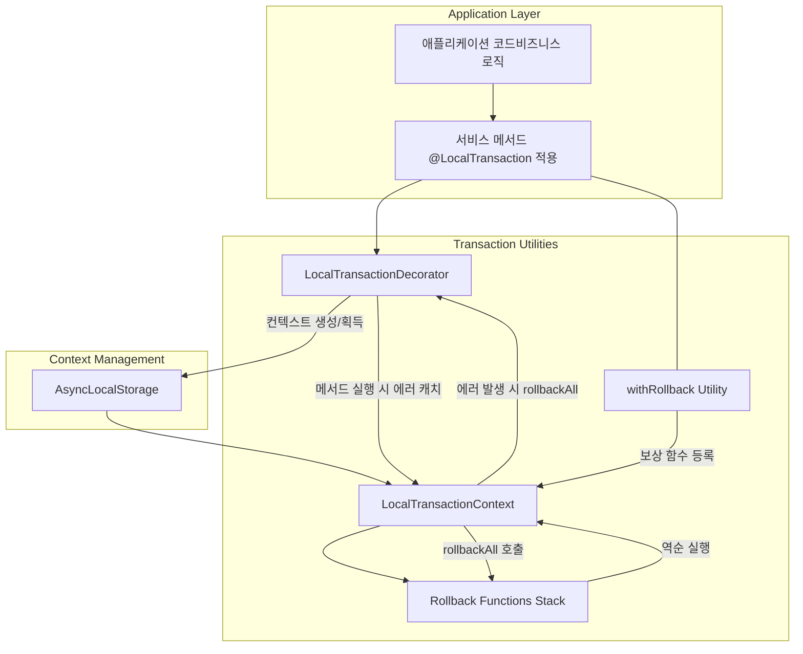

# LocalTransaction Utility

## 개요

해당 유틸리티는 Node.js 환경에서 **SAGA 패턴**에 대응하는 **로컬 트랜잭션(Local Transaction)** 을 **간단하고 선언적인 방식**으로 구현하기 위한 유틸리티입니다.

- **주요 목적**
    1. **단계적(체이닝) 작업**을 수행하다가, 어떤 단계에서 실패(에러)하면 **이전 단계들을 보상(rollback)** 할 수 있도록 지원합니다.
    2. **데코레이터(@LocalTransaction)** 를 이용하면 **메서드 범위**에서 트랜잭션 컨텍스트를 자동 생성 및 에러 발생 시 rollbackAll 실행을 보장합니다.
    3. **withRollback** 함수를 통해 **동기/비동기 작업**을 프로미스로 래핑하고, **역순 실행**되는 보상 함수를 간편하게 등록할 수 있습니다.

## 프로젝트 구조

이 프로젝트는 **monorepo** 구조로 구성되어 있습니다:

```
saga/
├── src/                          # 라이브러리 소스 코드
│   ├── index.ts                  # 메인 export 파일
│   └── LocalTransaction/         # LocalTransaction 유틸리티들
├── example/                      # 예제 애플리케이션 (별도 패키지)
│   ├── package.json             # example 패키지 설정
│   ├── index.ts                 # 예제 실행 파일
│   └── *.ts                     # 예제 서비스 파일들
├── package.json                 # 루트 패키지 (workspaces 설정)
└── dist/                        # 컴파일된 라이브러리 출력
```

### 설치 및 실행

1. **의존성 설치**:
   ```bash
   pnpm install
   ```

2. **라이브러리 빌드**:
   ```bash
   pnpm build
   ```

3. **예제 실행**:
   ```bash
   cd example
   pnpm start
   ```

### 특징

- **AsyncLocalStorage** 사용
    - 각 요청/비동기 흐름마다 독립된 트랜잭션 컨텍스트를 관리.
    - 데코레이터가 없을 때도 수동으로 `localTransactionContextStorage.run(...)`으로 컨텍스트 범위를 지정할 수 있음.
- **동기/비동기 함수** 모두 처리 가능
    - `withRollback(action)`에서 동기/비동기 `action`과, `.rollback(fn)`에서 동기/비동기 `fn`을 모두 지원
- **단순화된 "부분 롤백"**
    - 단계별 보상 로직(rollbackFn)을 등록하고, 에러 발생 시 진행 상황까지의 동작을 **등록 순서의 역순**으로 실행

---

## 사용 예시

### 1. **TypeScript + 데코레이터 방식**

아래 예시는 TypeScript 코드에서 **@LocalTransaction** 데코레이터를 사용해 로컬 트랜잭션을 자동으로 생성하고,  
`withRollback` 체이닝을 통해 보상 로직(rollback)을 등록하는 대표적인 구조입니다.

```ts
import {LocalTransaction} from './LocalTransactionDecorator';
import {withRollback} from './withRollback';

@LocalTransaction({catchUnhandledError: true})
async function sagaMethod(): Promise<void> {
    // 1) 동기 작업 + rollback 등록
    const syncResult = await withRollback(getFoo())
        .rollback(() => syncRollback());
    console.log('syncResult =', syncResult);  // 'Foo'

    // 2) 비동기 작업 + rollback 등록
    const asyncResult = await withRollback(gerBar())
        .rollback(() => asyncRollback());
    console.log('asyncResult =', asyncResult);  // 'getBar'

    throw new Error('[sagaMethod] error for testing');
}
```

**설명**

- `@LocalTransaction` 데코레이터가 메서드 실행 전후로 트랜잭션 컨텍스트를 생성/획득합니다.
- 내부에서 에러가 발생하면, 이미 등록된 rollback 함수들이 **역순**으로 호출됩니다.
- 동기 작업/비동기 작업 모두 `withRollback(...)` + `.rollback(...)` 체이닝으로 보상 로직을 붙일 수 있습니다.

---

### 2. **JavaScript + (No Decorator) 방식**

데코레이터를 사용할 수 없는 환경(혹은 Plain JS)이라면, **직접 컨텍스트를 생성**하고 `withRollback`을 호출해 보상 로직을 등록할 수 있습니다.

```js
const {localTransactionContextStorage} = require('./LocalTransactionContextStorage');
const {LocalTransactionContext} = require('./LocalTransactionContext');
const {withRollback} = require('./withRollback');

async function sagaMethodPlainJS() {
    // 1) 새 컨텍스트 만들기
    const ctx = new LocalTransactionContext();

    try {
        // 2) localTransactionContextStorage.run을 통해 이 컨텍스트 범위 내에서 작업
        await localTransactionContextStorage.run(ctx, async () => {
            // 동기
            const syncResult = await withRollback(getFoo())
                .rollback(() => syncRollback());
            console.log('syncResult =', syncResult);

            // 비동기
            const asyncResult = await withRollback(getBar())
                .rollback(() => asyncRollback());
            console.log('asyncResult =', asyncResult);

            // 에러발생
            throw new Error('[sagaMethodPlainJS] error for testing');
        });
    } catch (error) {
        console.error('[ERROR] sagaMethodPlainJS:', error.message);

        // 3) rollbackAll() 실행
        if (ctx.hasRollbacks() && !ctx.isExecuted()) {
            console.log('[ROLLBACK] Executing rollbackAll');
            await ctx.rollbackAll();
        }
    }
}
```

**설명**

- **`localTransactionContextStorage.run(ctx, callback)`**: 해당 콜백 실행 중에는 `ctx`가 활성 컨텍스트가 됩니다.
- `withRollback(...)`이 `.rollback(...)`을 호출할 때 **현재 활성 컨텍스트**에 보상 함수를 추가합니다.
- 콜백 내부에서 에러가 발생하면, 상위에서 수동으로 `ctx.rollbackAll()`을 호출하거나, 별도의 에러 핸들링 로직에 포함시킬 수 있습니다. (데코레이터 없이 직접 제어 가능)

---

## await 위치에 대한 주의사항

1. **withRollback**는 항상 **Promise**를 반환하므로, 결과(`T`)를 얻기 위해서는 `await`해야 합니다.
   ```ts
   const result = await withRollback(someAction());
   ```

2. **동기 함수**도 `withRollback(fn())` 형태로 감싸면,
    - 내부적으로 `Promise.resolve(fn())` 처리 → 반환값도 Promise.
    - 따라서 `await`으로 풀어야 결과를 사용할 수 있습니다.

3. **rollback** 함수는 에러가 발생했을 때 내부에서 자동 실행되므로, 롤백 함수 호출에 대해 직접 `await`할 필요는 없습니다.
    - `.rollback(fn)`은 "보상 로직 등록"만 수행.
    - 실제 실행은 "에러 발생 시점" → "데코레이터나 수동 rollbackAll()에서 역순 호출"

# 구조




> [블로그 article](https://velog.io/@jrjr519/Mongodb-SAGA-%ED%8C%A8%ED%84%B4-%EC%A0%81%EC%9A%A9%ED%95%98%EA%B8%B0)
